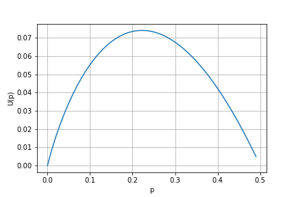

## Topic 1: Akerlof Lemon Market
### **1.A Selling a used car**
* Quality of the car: $v \in [0,1]$
    * Buyer: The car is worth $v$.
    * Seller: The car is worth $f(v)$.
  
### **1.B When information is symmetric**

When no trade:
* Buyer gets 0.
* Seller gets $f(v)$.

When trade at price $p$,
* Buyer gets $v-p$. (*ass: quasilinear preference*)
* Seller gets $p$.

Hence, the trade is always required at $p \in [f(v),v]$ and the trade is always <mark>Pareto improving</mark>.

### **1.C When information is assymetric**

Now $v$ is a R.V. and is assumed to follow uniform distribution. When trade at price $p$,
* Buyer gets $E[v]-p$.
* Seller gets $p$.

$v$ is seller's <mark>type</mark> (revealing some information of product quality).

#### __Game 1: Buyers make the offer:__
* Offer made at price $p$.
* Seller accepts:
    * Buyer gets $E[v-p]$.
    * Seller gets $p$.
* Seller rejects:
    * Buyer gets $0$.
    * Seller gets $f(v)$.

__Obs. 1: Seller accepts iff $f(v) \leq p$.__

Seller's type $v \leq f^{-1}(p)$, implying the car is not too great (a lemon as opposed to a peach).

$\Rightarrow$ <mark>Adverse selection:</mark> transaction is possible only when it is of an “inferior” quality. (e.g. health insurance, when people are buying insurance mostly when they are aware of some health problems).

__Obs. 2: Buyer would not offer $p > \bar{p}:=f(1)$.__

The payoff to seller $p-f(v)$ is always positive regardless of $v$, hence buyer always pays more than he should.

Offering $p > \bar{p}$ is a dominated strategy.

__Obs. 3: By offering a price p, buyer's expected payoff is $U(p)=f^{-1}(p)(\frac{1}{2}f^{-1}(p)-p)$__

*Proof:*
$$U(p)=E[v-p]=Pr(trade|p)E[v-p|p]=f^{-1}(p)(\frac{1}{2}f^{-1}(p)-p)$$
Since when $v < f^{-1}(p)$, then trade can happen and $v$ is assumed to be uniformly distributed.

Equivalently,
$$U(p)=\int_0^{f^{-1}(p)}(v-p)dv$$

**PBE.** $p^*$ is an EQ offer iff $p^* \in max_{p \in [0,\bar{p}]}U(p)$.

1. No trade: when $U(p) < 0$ for all $p \ in (0,\bar{p}]$, there is a UNIQUE PBE:
    * Buyer offers $p=0$.
    * Seller has no trade option.
    * Pr of trade is 0.
    * Example: $f(v)=\alpha v$ where $\alpha \in (1/2,1)$, then 
    $$U(p)=(1-2\alpha)\frac{p^2}{2\alpha^2}<0 \quad \forall p>0 $$
    $v \leq p/\alpha$ suggests the seller are more likely to take the offer when $\alpha$ is small, which means the quality is low. **Only losers would accept offer.** Adverse selection is working.

2. Occational trade: when $U(p) > 0$ for some $p \ in (0,\bar{p}]$, there can be one/multiple PBE:
    * Buyer offers $p^*>0$.
    * Seller accepts the trade iff $v \leq f^{-1}(p^*)$.
    * Pr of trade is $f^{-1}(p^*)$.
    * Example: $f(v)=v^2/2$, then $\bar{p} = 1/2$ and 
    $$U(p)=p(1-\sqrt{2p})$$
    From the plot below, easy to see $p^*$ is around 0.22 and Pr of trade is $f^{-1}(p^*) \in (0,1)$, meaning not all trades will be accepted by seller. Hence, there are some inefficiency.
    
    

3. Always trade: $\bar{p}$ is exactly $p^*$.
    * Buyer will make the offer and seller will accept.
    * Necessary condition: $\bar{p} \leq \frac{1}{2}f^{-1}(\bar{p}) \leq \frac{1}{2}$. Even the best car will not be worth more than $1/2$ to seller.
    * Example: $f(v)=\alpha v$ where $\alpha \in [0,1/2)$, then 
    $$U(p)=(1-2\alpha)\frac{p^2}{2\alpha^2}>0 \quad \forall p>0 $$
    , and is increaing in $p$, suggesting $p^*=\bar{p}=\alpha$.
    Small $\alpha$ means seller does not value the car much, hence is willing to accept a low price. Buyer will offer a highest reasonable (lower than $\alpha$) price to get the best quality car.

__Game 1 Summary:__
* Information asymmetry can lead to "market failure":
    * Adverse selection is at work.
    * Ineffiency may happen.

#### __Game 2: Seller makes the offer.__
* Offer made at price $p$.
* Buyer accepts:
    * Buyer gets $E[v-p]$.
    * Seller gets $p$.
* Buyer rejects:
    * Buyer gets $0$.
    * Seller gets $f(v)$.

__Obs. 1: All types($v$) of seller succeed in selling the car will offer the **same** price $p^*$.__

Suppose $p$ (type $v$) and $p' < p$ (type $v'$) will be all accepted by the buyer, buyer will deviate to a higher price $p$. Then, all types of seller will end in the game of offering the same price (the highest price that the buyer will accept).

__Obs. 2: If trade happens at EQ (price at $p^*$), then seller offers $p^*$ iff $f(v) \leq p^*$.__

__Obs. 3: $U(p^*) \geq 0$.__

**PBE.** $p^*$ is an EQ offer when $U(p^*) \geq 0$ and $f(v) \leq p^*$.

1. No trade: for all $p \in (0,p^*)$, $U(p) < 0$.
2. Some trades: for some $p \in (0,p^*)$, $U(p) \geq 0$. Then offering a price $p^*$ where $U(p^*) \geq 0$ is a PBE. 
When $f(v) \leq p^*$, trade happens ($p^* < \bar{p}$). 
3. All trades: If $U(\bar{p}) \geq 0$, trade always happens at $p^*=\bar{p}$.

__Game 2 Summary:__
* "Market failure" is less serious:
    * Available trades under buyer-offering game is always available in seller-offering case. Seller-offering game may have more trades.
    * Pareto efficiency is easier to get.
* The highest probability of trade:
$$\pi = max\{p \in [0,1/2]:U(p) \geq 0 \}$$

### **1.D Notes**

### **1.E Questions**
**Q1: Suppose $f(v)=\frac{v^2}{2}$ and the quality is $v \in [0,1]$. The buyer offers the price, identify all the pure PBE.**

*Sol:*
From Obs. 3, 
$$p^* = argmax_p[f^{-1}(p)(\frac{1}{2}f^{-1}(p)-p)]
\\ = argmax_p[\sqrt{2p} (\sqrt{2p}/2-p) ]
\\ \Rightarrow p^* = 2/9$$
Hence, the buyer offers $2/9$ at PBE and the seller will accept if $f(v)<2/9$.

**Q2: Suppose now the seller offers the price, identify all the pure PBE (remember to specify the non-equilibrium path beliefs).**

*Sol:* From summery of game 2, in the pure PBE $p^* > f(v)$ and $U(p^*) \geq 0$.
$$U(p)=E[v]-p \geq 0 \Rightarrow p^* \leq \frac{1}{2}$$
Taking any $p \in [0,1/2]$, $U(p) \geq 0$. Hence, in a PBE, seller offer any $p^* \in [0,1/2]$, and the buyer will accept the price with the belief $v \leq f^{-1}(p)$. If the buyer sees other prices, $v=0$, indicating no purchase happens.

**Q3: Now suppose $f(v) = 2/3v$ and the buyer offers the price. Suppose before the trade, the seller can get a costless warrant, which will credibly convey the true quality of the car. What types of the seller would like to get the warrant?**

*Sol:* Similiarly,
$$p^* = argmax_p[f^{-1}(p)(\frac{1}{2}f^{-1}(p)-p)]
\\ = argmax_p[\frac{3}{2}p(\frac{3}{4}p-p)] \Rightarrow p^* = 0$$
Hence, no trade will happen.
If the seller reveals its true value $v$, $U(p)=v-p$, such that 
$p^*=argmax_p[v-p]$, and the seller will accept when $p^* \geq \frac{2}{3}v$. Hence, by revealing, sellers always have chance to make the trade and they should all reveal their true value.

**Q4: Suppose before the trade, the seller can get a warrant, which will credibly convey the true quality of the car. The warrant costs 0.05. What types of the seller would like to get the warrant?**

*Sol:* Now seller will accept the offer only when $p^*-0.05 \geq \frac{2}{3}v$ and $p^* \leq v$. Obviously, when $0.05+\frac{2}{3}v \geq v$, seller has no incentive to reveal since he will reject the best offer for sure. That yields $v \leq 0.15$.