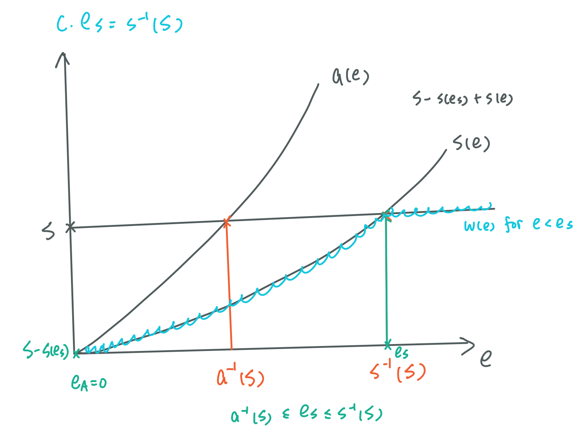
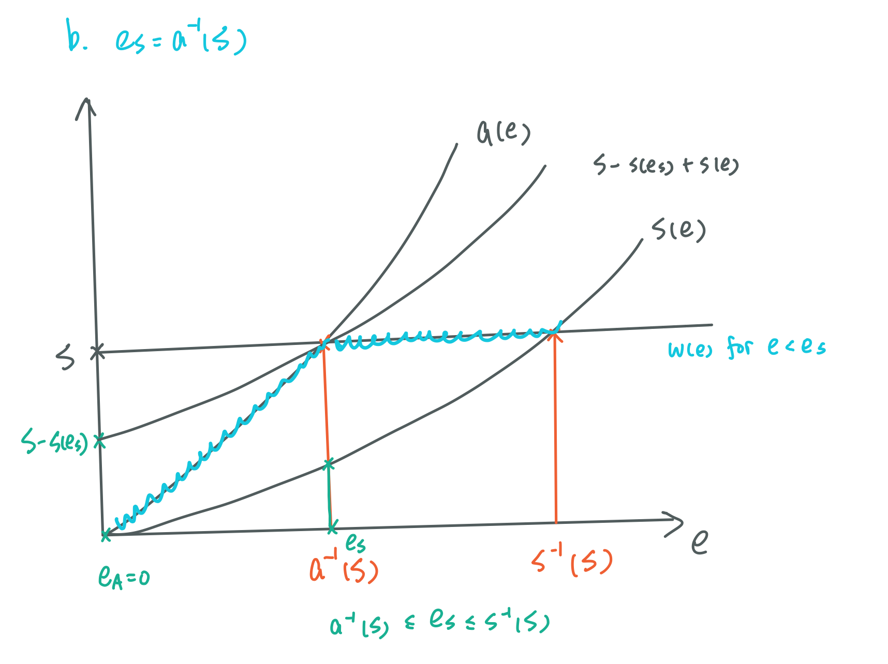
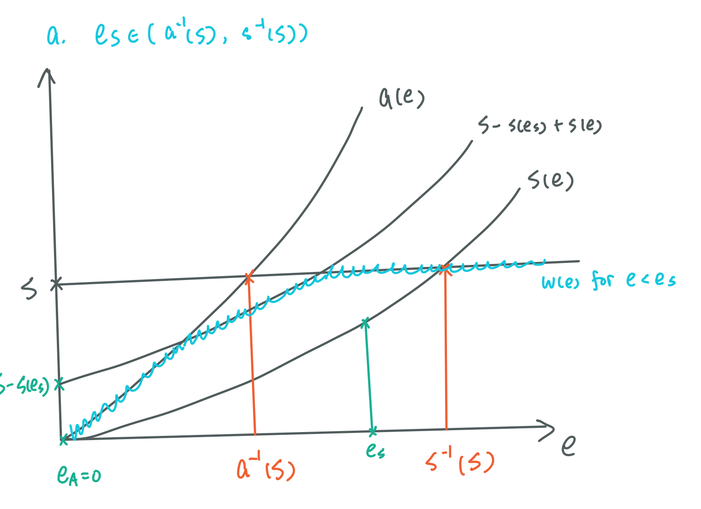
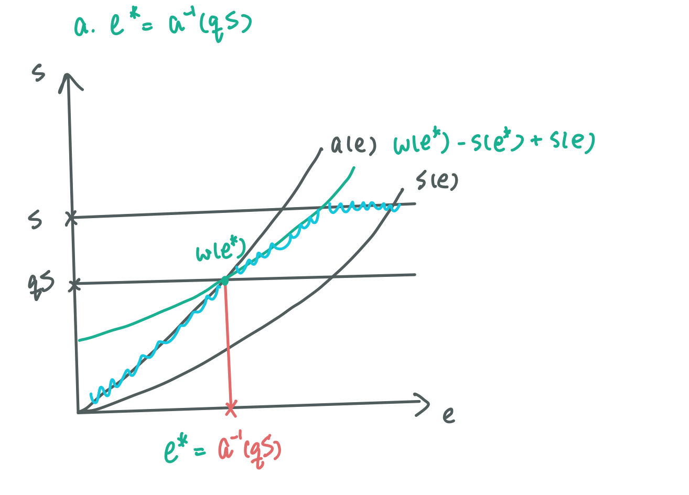
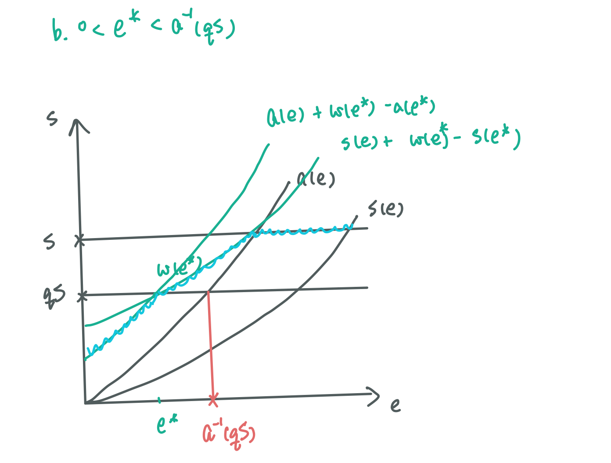
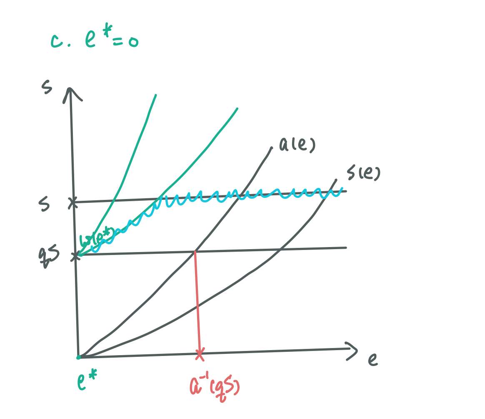
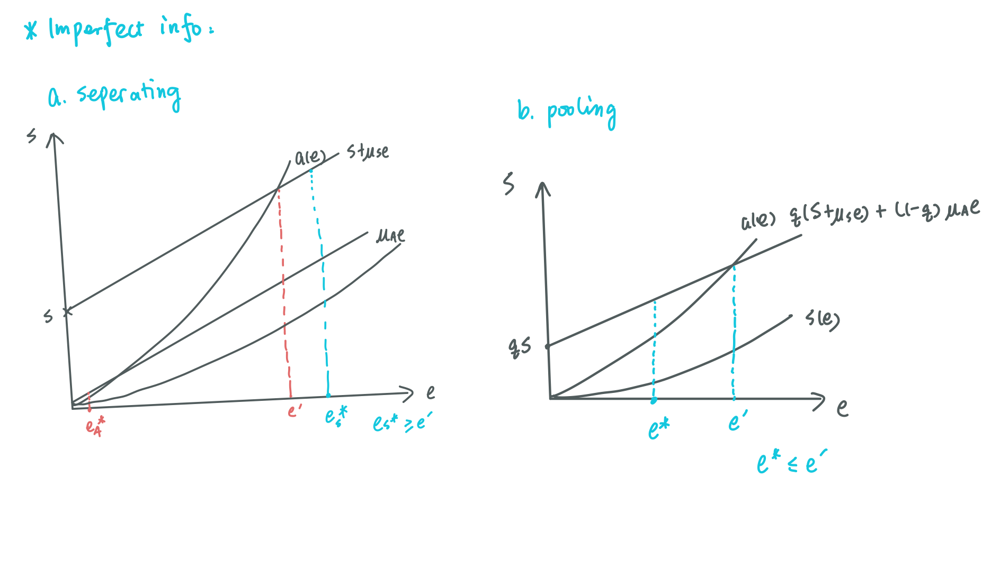
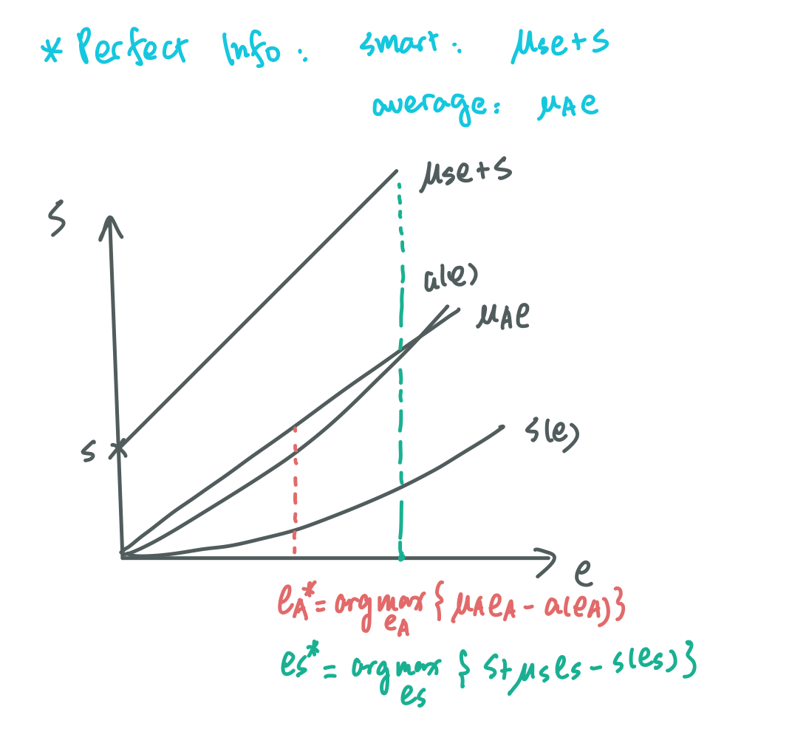

## Topic 2: Spence Signaling Game
### 2.A Signaling game: choose eduacation level
**Signalling game:**
* Two players: Sender and Receiver.
* Sender has multiple types, his private information.
* Sender takes an action that may or may not depend on his type (information transmission).
* Receiver sees Sender’s action, updates his belief about Sender’s type, takes action himself.

**Example: choosing education level**
* Type of Tom: Smart or Average **(sender's info)**
* Tome decides on education level. **(sender's action)**
* Boss will pay $S$ to smart person; $0$ to average person (or to say want to pay $S$ more). **(receiver's response)**

### 2.B Game in sequence
* Stage 0. Tom is born, and prob of Tom being Smart is $q$.
* Stage 1. Tom chooses education level $e$.
* Stage 2. Boss sees $e$, offers $w$.

**Boss's problem:**
* Education level ($e \in \mathbb{R}^+$) updates Boss's belief about Tom: probability of Tom being smart ($p(e) \in [0,1]$). In EQ, Boss pays $p(e)S$.

**Tom's problem:**
* Tom knows his type. 
* Education will occur cost.
  * Different type indicates different cost function for education: $a(e)$ and $s(e)$.
  * $a(0)=s(0)=0$, since no education occurs no cost.
  * $a(e)$ and $s(e)$ are both increasing and convex, since usually it will cost more to get higher education.
  * Smart Tom handles education more easily, $s(e) < a(e)$ and $s'(e) < a'(e)$.

**PBE Analysis:**
* Tom's strategy: 
  * $(e_S,e_A) \in \mathbb{R}^2_+$.
  * <mark>Sequential rationality</mark>: $e_S \in argmax_{e} w-s(e)$, $e_A \in argmax_{e} w-a(e)$
* Boss's strategy: 
  * Offer $w(e)=p(e)S$.
  * For $e \in \{e_S, e_A\}$,
  $$p(e)=\frac{Pr(\text{Tome is smart and chooses e})}{Pr(\text{Tom chooses e})}$$
  * For $e \notin \{e_S, e_A\}$, $p(e)$ can be any value in $[0,1]$.
* Equilibrium type: how much information is transmitted
  * Separating: different types take different actions, full info transmission.
  * Pooling: different types take the same action, no info transmission.
  * Partial pooling: in between, not a Spence model.
  
### 2.C Sperating PBE ($e_S \neq e_A$) 
**Obs. 1: $e_S \neq e_A$ transmits full information: Boss can accurately infer Tom's type.**
* $p(e_S)=1$, $p(e_A)=0$
* $w(e_S)=S$, $w(e_A)=0$
* $w(e)=p(e)S \in [0,S]$ for any other $e$ and Bayesian consistency does not bind.

**Obs. 2: $e_A=0$**
* Payoff to Tom $w(e_A)-a(e_A)=-a(e_A)$ is non-positive.
* No education is preferred (since full info is revealed and Boss will certainly not pay a positive amount to average Tom).

**Obs. 3: $a^{-1}(S) \leq e_S \leq s^{-1}(S)$**
Optimality of Tom's EQ strategy (seperating) implies:
* Smart Tom will choose $e_S$: $S - s(e_S) \geq 0$.
* Average Tom will choose $e_A$: $S - a(e_S) \leq 0$.

**Obs. 4: For any $e < e_S$ (Off-EQ path), $w(e) \leq min \{ a(e),[S-s(e_S)]+s(e)\}$**
* Obviously, no type would deviate to $e > e_S$.
* When $e < e_S$, for a smart Tom not to deviate, it requires 
$$S-s(e_S) \geq w(e)-s(e) \Rightarrow w(e) \leq [S-s(e_S)]+s(e)$$
* When $e < e_S$, for an average Tom not to deviate, it requires 
$$0-0 \geq w(e)-a(e) \Rightarrow w(e) \leq a(e)$$
* In summary, $w(e) \leq min \{ a(e),[S-s(e_S)]+s(e)\}$.

**Summary of PBE:**

$(e_A, e_S,w,p)$ constitudes a separating PBE iff:
* $e_A=0$
* $a^{-1}(S) \leq e_S \leq s^{-1}(S)$, indicating multiple equilibra.
* $w(e)=\begin{cases}
0,\quad &e=0 \\\\
S,\quad &e=e_S \\\\
\leq min \{ a(e),[S-s(e_S)]+s(e)\},\quad &e \in (0,e_S)
\end{cases}$
* $p(e)=\begin{cases}
0,\quad &e=0 \\\\
1,\quad &e=e_S \\\\
p(e)S=w(e),\quad &e \in (0,e_S)
\end{cases}$

**Off-EQ Path:**
* Situation c: When $e_S$ is exactly the highest value, the **maximun possible** wage will follow the $s(e)$ line. Avarage Tom will not deviate to $e$ since the cost is always higher than wage, hence only smart Tom will deviate to $e$. If Boss is clear about that, Tom can benefit from choosing a lower $e$ rather than $e_S$.

* Situation b: When $e_S$ is exactly the lowest value, an average will not any make profitable deviation and smart Tom will not as well.

* When $e_S$ is a random value in the range, the **maximun possible** wage will follow the blue curve. Like the analysis before, smart Tom will most likely deviate to $e = \underline{e_S}$ since average Tom will never devaite.

* Hence, any $e_S > \underline{e_S}$ will be out of the seperating EQ. **The only separating EQ is $e_S = \underline{e_S}$ and it is the most efficient (more education will not lead to higher wage).**

### 2.C Pooling PBE ($e_S = e_A = e^*$) 
**Obs. 1: $p(e^*)=q$, $w(e^*)=qS$**

Since probability of choosing $e$ is in regardless of being smart or avrage,
$$
p(e^*)=\frac{Pr(e^*|smart)Pr(smart)}{Pr(e^*)}=q
$$

**Obs. 2: $e^* \leq a^{-1}(qS)$**

Average Tom does not want to deviate to have no education:
$qS-a(e^*) \geq 0-0$.

**Obs. 3: For any $e \neq e^*$, $w(e) \leq min\{[w(e^*)-s(e^*)]+s(e),[w(e^*)-a(e^*)]+a(e)\}$**

There should be no profitable deviation for both Toms:
$$w(e) - s(e) \leq w(e^*) - s(e^*)$$
$$w(e) - a(e) \leq w(e^*) - a(e^*)$$

**Summary of PBE:**

$(e_A, e_S,w,p)$ constitudes a pooling PBE iff:
* $e_S=e_A:=e^*$
* $e^* \leq a^{-1}(qS)$
* $w(e)=\begin{cases}
qS,\quad &e=e^* \\\\
\leq min \{[w(e^*)-s(e^*)]+s(e),[w(e^*)-a(e^*)]+a(e)\},\quad &else
\end{cases}$
* $p(e)=\begin{cases}
q,\quad &e=e^* \\\\
p(e)S=w(e),\quad &else
\end{cases}$

**Off-EQ Path:**
* Situation a: When $e_*$ is exactly the highest value, the **maximun possible** wage is the blue line. Smart Tom can deviate a little bit for a positive return but an average Tom will never deviate to a higher $e$. Hence, if Boss is clear about that, he will know $e>e^*$ is a smart Tom and will offer $S$. Hence, the EQ collapses.

* Situation b: When $e_*$ is in the range of $(0,a^{-1}(qS))$, a smart Tom can deviate to a larger $e$ with the same return. However, an average Tom will get decreasing but positive return when deviating to a larger $e$. Hence, the EQ also collapses.

* When $e_*=0$, similar to case b, a smart Tom can always deviate, leading to collapse of EQ. However, whem $e^*=0$, the EQ is most efficient, since there is no need for education and everyone will get paid.

* In summary, no pooling PBE can exist by <mark>intuitive criterion</mark>.

### 2.D Notes

### 2.E Questions
**Q1: Is the game with signalling always Pareto dominates the game without signalling (but with asymmetric information)?**

*Sol:* Not always true. When no signalling, every Tom will get $qS$ and has no incentive to have education ($e=0$).
* Pooling: At $e^* \geq 0$, Tom will get $qS$ as well. Hence, pooling equilibrium will be weakly dominated by no signalling situation.
* Separating: A smart Tom will get $S-s(e)$. Hence, if $S-s(e) \leq qS$, the separating equilibrium will also be (weakly) dominated by no signalling case. An average Tom will get $0$ in separating equilibrium, hence he will strictly prefer the no signalling situation. The intuition is that when $q$ is high enough, there is no need to use education to signal.

**Q2: Now assume that two companies simultaneously make wage offers to Tom. The productivity of the smart Tom is $S+\mu_s e$, and the productivity of the average Tom is $\mu_ae$. $e$ is the education level. We have $S>0$ and $\mu_s>\mu_a>0$. Identify the separating and pooling perfect equilibria. How are they related to the perfect information competitive outcome?**

* Imperfect information:
  
  **For separating PBE:** companies will know which Tom is smart, and hence pay $S+\mu_se$ to smart Tom with $e_S^*$ and pay $\mu_Ae$ to avarage Tom with $e_A^*$. For the PBE to be held,
  1. Every Tom maximizes their utility:
  $$e_S^*=argmax_e[S+\mu_Se-s(e)]$$
  $$e_A^*=argmax_e[\mu_Ae-a(e)]$$
  2. No profitable deviation for average Tom, otherwise he will pretend to be smart:
  $$e_S^* \geq e', \quad where \quad a(e')=S+\mu_Se'$$   

  **For pooling PBE:** company cannot tell the difference, and thus offer the same wage. The wage is the expected wage with the previous belief that Tom is smart by prob $q$, thus $w(e)=q(S+\mu_Se)+(1-q)\mu_Ae$. For the PBE to be held:
  1. $e^*=e_A=e_S$, where $e_A=argmax_e[w(e)-a(e)]$ and $e_S=argmax_e[w(e)-s(e)]$. For this to be true, $e^*$ must be very small. However, by intuitive criterion, the pooling PBE will easily collapse since a smart Tom can deviate to indicate he is smart.

* Perfect information:

When the information is perfectly revealed, companies will offer different wages to different Toms. Hence, Tom will choose education level that maximizes their utility seperately, regardless of the other Tom's deviating. Hence, seperating PBE in imperfect information case will be included in this game, but some games will not be sustained in the asymetric information situation. 

**Q3: Now assume that two companies simultaneously make wage offers to Tom. Instead of just having two types, now the types of Tom (represented by productivity $x$) are drawn from the interval $[0, S]$, with a density function $f(x)$ strictly increasing everywhere on this interval. The cost of education is $c(e,x) = e^2/x$. Identify all the PBE.**

*Sol:*
* Separating PBE: 
  
  When companies can correctly infer Tom's type from his education, companies will offer $x$ in PBE since 2 companies are in competition. At $e = e^*$, $w(e^*)=x$.
  
  Tom's utility is $w(e)-e^2/x$, and his utility is maximized at $e^*=argmax_e[w(e)-e^2/x]$. By FOC, at $e=e^*$, $w'(e^*)=2e^*/x$.

  Hence, $w(e^*)w'(e^*)=2e^* \Rightarrow [w(e)^2]'=4e \Rightarrow w(e)=2e^2+C \Rightarrow w(e)=\sqrt{2e^2+C}$. Since when $x \rightarrow 0$, $e \rightarrow 0$, $C=0$ for $e^*=0$. Therefore, $w(e)=\sqrt{2}e$ and $e^*=x/\sqrt{2}$

* Pooling PBE:
  
  When companies cannot infer from the information, $w(e)=E[x]$ and $e^*$s are all the same. Hence, $e^*=0$ and $w^*=E[x]$.

* An offequilibrium path can be that if the companies see off-equilibrium education level, they believe Tom has productivity zero with probability 1 and oers $w = 0$.