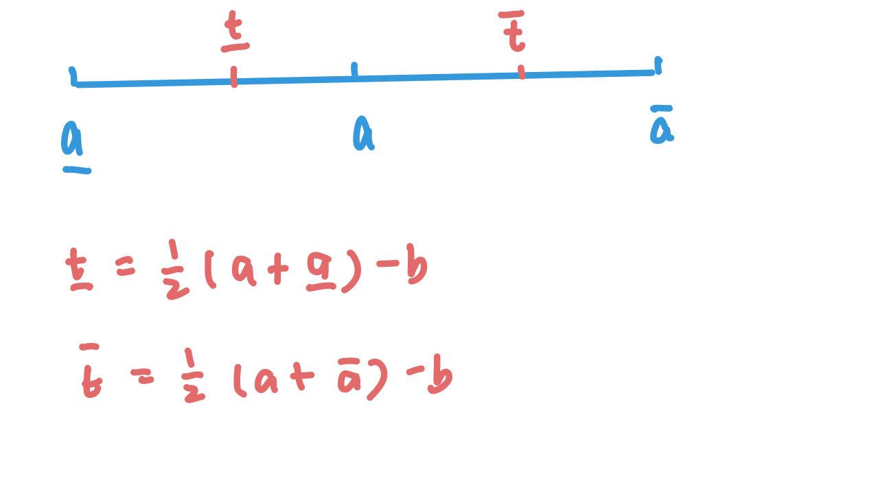
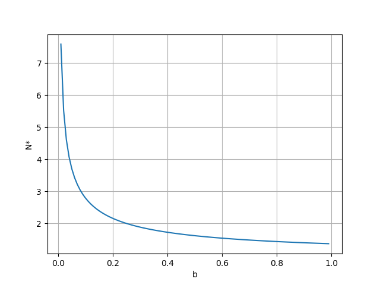

## Topic 3: Cheap Talk
### 3.A Signalling without cost
* Governor: Sender(**S**)
* President Receiver(**R**)
* true state of accident: $t \in [0,1]$
* action for funding: $a \geq 0$

The Governor meets the President for emergency funding. The Governor knows $t$ and there is no way to know $t$ from others.

The President determines $a$ solely and <ins>he does not know $t$ at all</ins>. He has prior belief that $t$ is uniformly distributed.

(<ins>does not know</ins>: 1. uncertainty: not sure about the distribution; 2. ambiguity: do not know about the distribution, may simply assume distribution is uniform.)

**What will the Governor tell about the state?**
* Payoff function for **R**: the Receiver wants to know the truth (ideal action: $a=t$).
  $$U^R(a,t)=-(a-t)^2$$
* Payoff function for **S**: the Sender may have mis-alignment of interest (ideal action: $a=t+b$).
  $$U^S(a,t)=-(a-b-t)^2$$

**Cheap Talk Game:**
* Stage 1: Sender sends the message $m \in [0,1]$, where $\mu(t)=m$, $\mu:[0,1] \to [0,1]$. 
  * $\mu$ may NOT be 1-to-1 function.
  * Denote $T(m)=\mu^{-1}(m)$ as sender's type. $T(m)$ can be a set given a $m$.
* Stage 2: Receiver makes the decision $a$, where $a=\alpha(m)$, $\alpha:[0,1] \to \mathbb{R}_{+}$
  * Receiver updates his belief to $\pi(m)$, where $\pi:[0,1] \to \Delta[0,1]$
* Sequential rationality:
  * R: $\alpha(m) \in argmax_a \int_0^1 U^R(a,t)d\pi(m)$
  * S: $\mu(t) \in argmax_a \int_0^1 U^R(a,t)d\pi(m)$
* Bayesian consistency:
  * On EQ path: if $T(m) \neq \empty$, then $\pi(m)$ is the uniform distribution over $T(m)$.
  * Off EQ path: if $T(m) = \empty$, then $\pi(m)$ is unrestricted.

### 3.B Truth-telling and 1-to-1 message function:
**PBE. There is no PBE when $\mu(t)=t$ or $\mu$ is 1-to-1 function.**
* If $\mu$ is 1-to-1 function, $T(m):=\mu^{-1}(m)$ is a singleton for on-path messages.
* Suppose if PBE exists for $\alpha(m)=t$, $U^S=-b^2$. However, when **S** deviates to $\mu(t')$ where $t'>t$, $U^S(t',t)=-(t'-t-b)^2>-b^2$ and the EQ collapses.
* $\pi(m)$ can reveal true state from $T(m)$ with certainty: there is always profitable deviation for **S** such that **S** and **R** can never in the PBE.
* 1-to-1 exaggeration or understatement is also ruled out in PBE.

### 3.C Babbling(pooling) PBE:
**PBE. $\mu$ is a constant.**
* Babbling means sending message is never useful and hence the message appears to all the same.
* e.g. $\mu(t)=0.888$ for all $t$. \
**R** does not update his belief: $\pi(0.888)=U[0,1]$ and $\alpha(0.888)=0.5$.
* For any $m \neq 0.888$, $\pi(0.888)=U[0,1]$ and $\alpha(0.888)=0.5$. Unexpected messages are "typos".

### 3.D General PBE:
* WLOG, $\alpha(m)$ is 1-to-1 function for on-path messages.
* Other PBEs are equivalent to these. 

**Obs. 1: If $m$ is on-path, then $T(m)$ is an interval.**

*Proof:* \
For message $m$, denote $a:=\alpha(m)$. \
There should be no profitable deviation for sender $t \in T(m)$:
$$-(a-b-t)^2 \geq -(\alpha(m')-b-t)^2, \forall m' \neq m$$
$$\Rightarrow (\alpha(m')-a)(\alpha(m')+a-2b-2t) \geq 0$$
The inequality above shows $t$ are bounded by the interval:
* When $\alpha(m') \geq a$, $t \leq \frac{1}{2}(\alpha(m')+a)-b$
* When $\alpha(m') \leq a$, $t \geq \frac{1}{2}(\alpha(m')+a)-b$

Hence, PBE pooling with nearby types:
* A PBE is "partitional" and can be represented by "**thresholds**":
  $$(t_0=0,t_1,...,t_{N-1},t_N=1)$$
* For the i-th interval $(t_{i-1},t_i)$:
  * Same messages is used: $m_i:=\mu_t, t \in (t_{i-1},t_i)$
  * Same action is taken and **R**'s posterior belief is $t$ uniformly distributed in this interval: $a_i:=\alpha(m_i)=\frac{t_i+t_{i-1}}{2}$

**Obs. 2: $a_{i+1}-a_{i}$ is uniformly bounded away from 0, and hence $N < \infty$.**

*Proof:*

* For action $a$, suppose its nearby action is $\bar{a}$ and $\underline{a}$. Left to show $\bar{a}-a > 0$.
* From Obs. 1, it is known that for action $a$, the upper threshold is $\bar{t}=\frac{1}{2}(a+\bar{a})-b$ and the lower threshold is $\underline{t}=\frac{1}{2}(a+\underline{a})-b$. Hence, $a \in [\underline{t},\bar{t}]$ gives a natural constraint on $\bar{a}-a$($a-\underline{a}$), which is $\bar{a}-a \geq 2b$.
* As long as $b \neq 0$, there will be a gap between 2 actions and the gap is no less than $2b$.

*Remark:*
* There are only finitely many equilibrium messages/actions/thresholds.
* Truth-telling (infinite actions) can never be a PBE.
* If there is no interest conflict ($b=0$), truth-telling is best for both.

**Obs. 3: Types of thresholds are indifferent between the nearby two adjacent actions: $U^S(a_i,t_i)=U^S(a_{i+1},t_i)$ and hence type $t_i$'s ideal action ($t_i+b$) is equiv-distance to two adjacent actions.**

*Proof:*
* For $a_{i+1}>a_i$, $t_i = \frac{1}{2}(a_{i+1}+a_i)-b$. 
* $t_i+b=\frac{1}{2}(a_{i+1}+a_i)$ is obviously a mid-point between $a_{i+1}$ and $a_i$.

*Remark:*
* Threshold types are indifferent between 2 adjacent actions, and again proves other types are pooling to the nearest action.
* $U^S(a_i,t_i)=U^S(a_{i+1},t_i) \\
  \Rightarrow -(a_i-t_i-b)^2 = -(a_{i+1}-t_i-b)^2 \\
  \Rightarrow a_{i+1}+a_i = 2t_i+2b \\
  \Rightarrow (t_{i-1}+t_i)+(t_i+t_{i+1}) = 4t_i+4b \\
  \Rightarrow t_{i+1}-t_i = t_i-t_{i-1} + 4b$ \
  Intervals between thresholds are increasing by $4b$.
* $t_i=\sum_{j=1}^i[t_1+(j-1)4b]=t_1i+2bi(i-1)$
* $t_N=t_1N+2bN(N-1)=1$
* $t_1 > 0 \Rightarrow 1-2bN(N-1) > 0 \Rightarrow N < N^*$, where $N^*=\frac{2b+\sqrt{4b^2+8b}}{4b}=\frac{1}{2}+\sqrt{\frac{1}{4}+\frac{1}{2b}}$. Hence, the maximum number of intervals is decided by $b$.
  
**PBE. Summary**
$(t_0=0,t_1,...,t_{N-1},t_N=1)$ represents an $N$-interval PBE iff for $i=1,...,N-1$,
$$U^S(a_i,t_i)=U^S(a_{i+1},t_i)$$
, where
* $a_i=\frac{1}{2}(t_{i-1}+t_i)$
* $a_{i+1}-a_i \geq 2b$
* $t_{i+1}-t_i = t_i-t_{i-1} + 4b$

*Remark:*
* $t_1$ decides subsequent $t_i$, $t_i=t_1i+2bi(i-1)$.
* $\{t_i\}$ decides $\{a_i\}$.
* $N < N^* = \frac{1}{2}+\sqrt{\frac{1}{4}+\frac{1}{2b}}$
* $t_N=1 \Rightarrow t_1N+2bN(N-1)=1$ solves for $t_1$. 
* Hnece, **any PBEs with $N$ intervals have the same equilibrium**.
* **Multiple PBEs:** for $N=1,2,...,N^*$, there is unique PBE associated to each $N$.
  
### 3.E Remarks on EQ:
**Example: $b=1/16$**
* $N^*=3.37$
* $N=1$: babbling, $a_1=0.5$.
* $N=2$: $t_1=3/8$, $a_1=3/16$ and $a_2=11/16$.
* $N=3$: $t_1=1/12$ and $t_2=5/12$, $a_1=1/24$, $a_2=1/4$ and $a_2=17/24$.
* Interval width is increasing: messages are less informative when it describes the status more serious.

**Study on $b$:**

For a given $b$, we can find the corresponding $N^*$. Plot below shows how $N^*$ deceasing with increasing $b$. Notice that $N^*$ is going down quickly with $b$. With a large b if $N^* < 2$, then babbling will be the only PBE. As $b \to 1$, $N^* \to 1.366$ and thus there is always a babbling PBE.

**Remarks:**
* Language is "endogenous": 
  * Literal meaning is not important. 
  * Interpretation($T(m)$) of the words decides PBE. It requires both players use the same interpretation.
  * Unrealistic since literal meaning does affect decisions.
* No lies in PBE:
  * Because of Bayesian consistency.
  * A message can include more or less information to Receiver, however it cannot be misleading or deceiving.

### 3.F Questions

A CEO is being advised by a local manager about capital allocation to the manager. The
manager can say anything he wants to the CEO, at no cost. The CEO wants to gear her
decision to the local information that only the manager has, but the manager is known to want the decision to differ systematically from what the CEO would want in any particular state because of empire building. The CEO decides how much capital $a \geq 0$ to allocate, depending on the local state $t \in [0,1]$. The payoff function of the CEO is $U^C = -(a - t)^2$. And the payoff function of the manager is $U^M = -(a - t - b)^2, \ b > 0$.

---
**Q1: Prove that full revelation (truth telling) is not a PBE.**
  
  *Sol:*
  If truth-telling is PBE, then the receiver will maximize his utility at $t^*=a$.
  However, sender can always deviate to $t'=b+a$ to maximize his utility, which cannot be truth-telling any more.

---

---
**Q2: Let $b = 1/20$ , identify all (pure) PBE (consider CEO's action is one-to-one for on path messages).**
  
  *Sol:*
  * $N^* = 0.5+\sqrt{0.25+10} = 3.91 \to N^* = 3$
  * $N=1$: babbling, $a_1=0.5$.
  * $N=2$: $t_1=2/5$, $a_1=1/5$ and $a_2=7/10$.
  * $N=3$: $t_1=2/15$ and $t_2=7/15$, $a_1=1/15$, $a_2=3/10$ and $a_3=22/30$.

---

---
**Q3: Let $b = 1/20$ . Suppose instead of listening to the report from the manager
and playing a game as described above, the CEO can also choose to delegate the decision-making ( capital allocation) to the manager. Which way would the CEO prefer? Does CEO's preference depend on b? Explain intuitively.**

  *Sol:*
  * If manager makes the decision, he will choose $t=a+b$ to maximize his payoff, which yields CEO payoff $U^C=-b^2=0.0025$.
  * If CEO makes the decision, his best payoff is 
  $$U^C = \int_0^1-(t-a_i)^2dt = \\ 
  \int_0^{2/15}-(t-1/15)^2 + \int_{2/15}^{7/15}-(t-3/10)^2 + \int_{7/15}^1-(t-22/30)^2 = -0.016$$
  * CEO will prefer to let manager make the decision.
---

---
**Q4: Suppose now the CEO is being advised by two local managers. Local manager 1 and local manager 2 have identical (and perfect) local information and report simultaneously to the CEO. The utility function of the manager is $U^i = -(a - t - b_i)^2$, $b_i > 0$, $i = \{1,2\}$. Is full revelation a PBE in this case? If so, try to characterize one.**
 
  *Sol:*
  * Full revelation can be a PBE.
  * $$
      \alpha(m_1,m_2) = \begin{cases} 
      a,\quad &m_1 \neq m_2 \\\\
      0,\quad &else
      \end{cases}
      $$
  * Two managers will report the true and the same status $m(t)$, otherwise they will get $-(t+b)^2$ payoff.
  * Managers have no incentive to deviate: they will only deviate to the same type if they want positive funding, however they cannot deviate to the same type if their interest are different ($b_1 \neq b_2$).

---