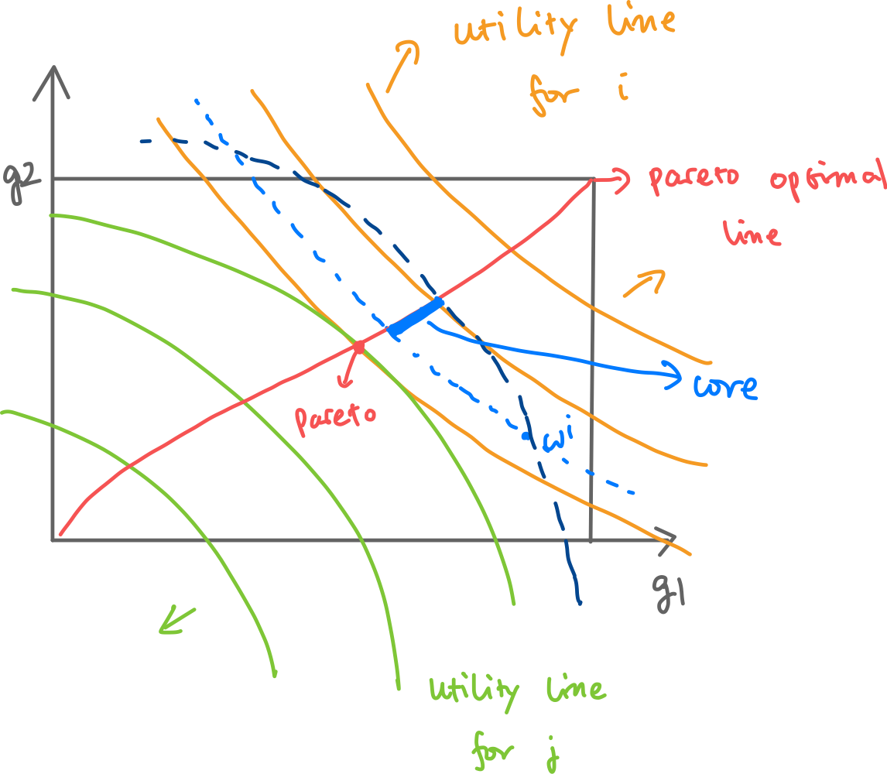

## Topic 9: General Equilibrium and Matching
### 9.A Exchange Economy
* $i = 1,...,n$ people
* $g = 1,...,m$ goods
* $i$’s utility from consumption bundle $x^i = (x^i_1,...,x^i_m)$ is $u^i(x^i)$
  * **Assumption**: $u^i$ is strictly increasing in every argument (**non-satiablility**).
* Everyone has initial endowment: $ww^i = (w^i_1,...,w^i_m)$
  * If one just consumes his initial **endowment**, he gets $\bar{u}^i := u^i(w^i)$
* Everyone can trade with others by exchanging/bartering.
  * Every $i$ gives $y^{ij}$ to every $j \neq i$.
    * $y^{ij} \geq 0$: cannot give by owning.
  * Every $i$ gets $y^{ji}$ from every $j \neq i$.
  * If $y^{ij} = y^{ji} = 0$, there is no trade.
  * Every $i$ ends up with bundle: $x^i = w^i + \sum_{j \neq i}(y^{ji} - y^{ij})$
* Market activities: $Y = (y^{ij})_{i \neq j}$
  * Who traded with whom by how much.
  * Property of $Y$:
    * **Feasibility:** For all $i \neq j$
      * $\sum_{j \neq i} (y^{ji} - y^{ij}) \leq w^i \Leftrightarrow x^i \geq 0$: net giving cannot exceed initial endowment; no one end up with owning.
    * **Stability:** "No group deviation"
      * There is no incentive for a group $S \subset \{1,...,n\}$ of people to, instead of
    carrying out trade given by ($y^{ij}$), trade among themselves: no such $S$ with feasible $z^{ij}$ that $u^i(w^i + \sum_{j \in S, j \neq i}(z^{ji} - z^{ij})) \geq u^i(x^i)$ for all $i \in S$ and **is strict for some $i$** (incentive for group deviation).
* Market outcome: $X = (x^i)_{i=1,...,n}$
  * $X$ is feasible/stable, if $X$ is from a feasible/stable $Y$.
  * Property of $X$:
    * **Prop. 1** $X$ is a feasible market outcome iff $\sum_i x^i = \sum_i w^i, x^i \geq 0, \forall i$. \
    * *Proof:* \
        Left to right is obvious by summing $x^i$ over all $i$. \
        Right to left follows $x^i \geq 0 \Rightarrow \sum_{j \neq i} (y^{ji} - y^{ij}) \leq w_i$ for each $i$.
    * **Assumption**: restrict discussion to all feasible outcomes.
    * **Prop. 2** A stable market outcome $X$ is *Pareto-optimal*.
      * *Pareto-optimal*: No another outcome $Z$ Pareto-dominating $X$: $u^i(z^i) \geq u^i(x^i)$ for all $i$, where inequality is strict for some $i$.
      * *Core*: the set of all stable market outcomes.
      * Reverse is not true: e.g. $x^1 = \sum_iw^i$ and $x^i = (0,...,0), \forall i \neq 1$
      * Edgeworth Box: 
      * *Proof:* \
        If there is $Z$ dominates $x$, then $X$ is not stable.
* Walrasian Tatonnement:
  * Step 1. A market maker [Walrasian Auctioneer] (may or may not be from the market) announces a price vector: A vector of positive numbers $p = (p_1,..., p_m)$, price here only helps to facilitate computation.
  * Step 2. Everyone $i$ honestly submits demanded bundle $x^i \geq 0$ to maximize $u^i$ , and $x^i$ has to satisfy $p x^i \leq p w^i$ ("budget constraint").
  * Step 3.a If $\sum_i x^i = \sum_i w^i$, then market clears. (Market maker pools all endowments and redistribute $x^i$ to every $i$.)
  * Step 3.b If $\sum_i x^i \neq \sum_i w^i$, then market does not clear, and market maker has to start over again to clear the market.
* Walrasian equilibrium: $(X,p)$ such that $p$ clears the market in "Walrasian Tatonnement" and the result market outcome is $X$.
  * $(X,p)$ is a Walrasian equilibrium iff:\
    (1) Individual utility maximization: for every $i$, $u^i(x^i) \in argmax_{z^i:pz^i \leq pw^i} u^i(z^i)$.\
    (2) Market clearance: $\sum_i x^i = \sum_i w^i$.
  * Walrasian equilibrium always exists - infinitely many: if $(X,p)$ is, then $(X,ap),a \neq 0$ also is.
  * If all Walrasian equilibriums have the same outcome $X$, then we say it is a unique equilibrium.
  * Edgeworth Box: 
  * **Prop. 3** If $(X,p)$ is a Walrasian equilibrium, then $X$ is a stable trade outcome.
    * Walrasian equilibriums are "in the core".
    * *Proof:* \
      $X$ is not stable implies some $i$s did not maximize their utility at step 1, which is a contradiction.
  * **Corollary.** The core is nonempty.
  * **Corollary.** (First Fundamental Theorem of Welfare Economics) A Walrasian equilibrium is Pareto-optimal.
  * **Proposition.** (Second Fundamental Theorem of Welfare Economics) If $u^i$ is convex for every $i$, then for any Pareto-optimal trade outcome $X$ there is an endowment vector $w$ and price vector $p$ such that $(X,p)$ is a Walrasian equilibrium of the market with initial endowments $w$.