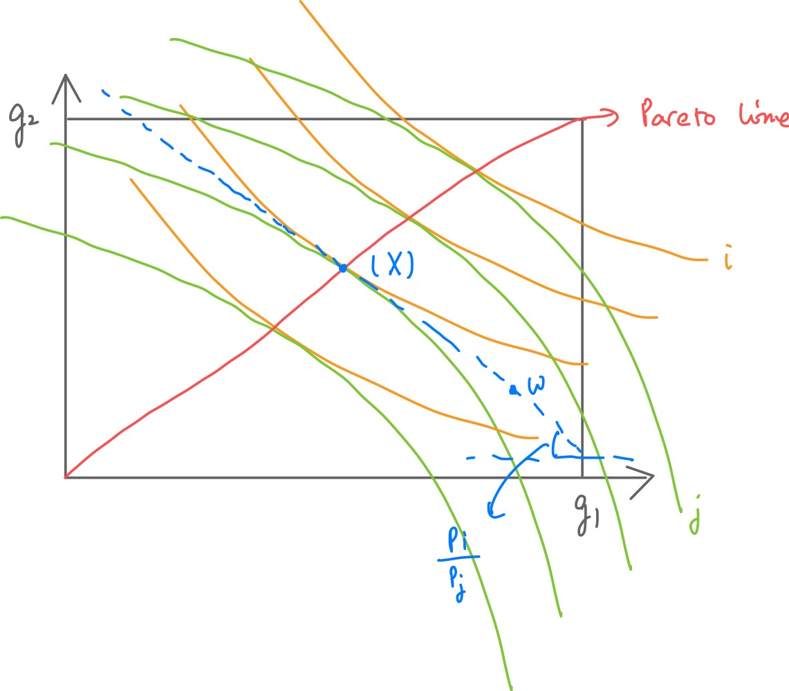

## Topic 9: General Equilibrium and Matching
### 9.A Exchange Economy
* $i = 1,...,n$ people
* $g = 1,...,m$ goods
* $i$’s utility from consumption bundle $x^i = (x^i_1,...,x^i_m)$ is $u^i(x^i)$
  * **Assumption**: $u^i$ is strictly increasing in every argument (**non-satiablility**).
* Everyone has initial endowment: $ww^i = (w^i_1,...,w^i_m)$
  * If one just consumes his initial **endowment**, he gets $\bar{u}^i := u^i(w^i)$
* Everyone can trade with others by exchanging/bartering.
  * Every $i$ gives $y^{ij}$ to every $j \neq i$.
    * $y^{ij} \geq 0$: cannot give by owning.
  * Every $i$ gets $y^{ji}$ from every $j \neq i$.
  * If $y^{ij} = y^{ji} = 0$, there is no trade.
  * Every $i$ ends up with bundle: $x^i = w^i + \sum_{j \neq i}(y^{ji} - y^{ij})$
* Market activities: $Y = (y^{ij})_{i \neq j}$
  * Who traded with whom by how much.
  * Property of $Y$:
    * **Feasibility:** For all $i \neq j$
      * $\sum_{j \neq i} (y^{ji} - y^{ij}) \leq w^i \Leftrightarrow x^i \geq 0$: net giving cannot exceed initial endowment; no one end up with owning.
    * **Stability:** "No group deviation"
      * There is no incentive for a group $S \subset \{1,...,n\}$ of people to, instead of
    carrying out trade given by ($y^{ij}$), trade among themselves: no such $S$ with feasible $z^{ij}$ that $u^i(w^i + \sum_{j \in S, j \neq i}(z^{ji} - z^{ij})) \geq u^i(x^i)$ for all $i \in S$ and **is strict for some $i$** (incentive for group deviation).
* Market outcome: $X = (x^i)_{i=1,...,n}$
  * $X$ is feasible/stable, if $X$ is from a feasible/stable $Y$.
  * Property of $X$:
    * **Proposition.** $X$ is a feasible market outcome iff $\sum_i x^i = \sum_i w^i, x^i \geq 0, \forall i$. \
    * *Proof:* \
        Left to right is obvious by summing $x^i$ over all $i$. \
        Right to left follows $x^i \geq 0 \Rightarrow \sum_{j \neq i} (y^{ji} - y^{ij}) \leq w_i$ for each $i$.
    * **Assumption**: restrict discussion to all feasible outcomes.
    * **Proposition.** A stable market outcome $X$ is *Pareto-optimal*.
      * *Pareto-optimal*: No another outcome $Z$ Pareto-dominating $X$: $u^i(z^i) \geq u^i(x^i)$ for all $i$, where inequality is strict for some $i$.
      * *Core*: the set of all stable market outcomes.
      * Reverse is not true: e.g. $x^1 = \sum_iw^i$ and $x^i = (0,...,0), \forall i \neq 1$
      * Edgeworth Box: 
      * *Proof:* \
        If there is $Z$ dominates $x$, then $X$ is not stable.
* Walrasian Tatonnement:
  * Step 1. A market maker [Walrasian Auctioneer] (may or may not be from the market) announces a price vector: A vector of positive numbers $p = (p_1,..., p_m)$, price here only helps to facilitate computation.
  * Step 2. Everyone $i$ honestly submits demanded bundle $x^i \geq 0$ to maximize $u^i$ , and $x^i$ has to satisfy $p x^i \leq p w^i$ ("budget constraint").
  * Step 3.a If $\sum_i x^i = \sum_i w^i$, then market clears. (Market maker pools all endowments and redistribute $x^i$ to every $i$.)
  * Step 3.b If $\sum_i x^i \neq \sum_i w^i$, then market does not clear, and market maker has to start over again to clear the market.
* Walrasian equilibrium: $(X,p)$ such that $p$ clears the market in "Walrasian Tatonnement" and the result market outcome is $X$.
  * $(X,p)$ is a Walrasian equilibrium iff:\
    (1) Individual utility maximization: for every $i$, $u^i(x^i) \in argmax_{z^i:pz^i \leq pw^i} u^i(z^i)$.\
    (2) Market clearance: $\sum_i x^i = \sum_i w^i$.
  * Walrasian equilibrium always exists - infinitely many: if $(X,p)$ is, then $(X,ap),a \neq 0$ also is.
  * If all Walrasian equilibriums have the same outcome $X$, then we say it is a unique equilibrium.
  * Edgeworth Box: 
  * **Proposition.** If $(X,p)$ is a Walrasian equilibrium, then $X$ is a stable trade outcome.
    * Walrasian equilibriums are "in the core".
    * *Proof:* \
      $X$ is not stable implies some $i$s did not maximize their utility at step 1, which is a contradiction.
  * **Corollary.** The core is nonempty.
  * **Corollary.** [First Fundamental Theorem of Welfare Economics] A Walrasian equilibrium is Pareto-optimal.
  * **Proposition.** [Second Fundamental Theorem of Welfare Economics] If $u^i$ is convex for every $i$, then for any Pareto-optimal trade outcome $X$ there is an endowment vector $w$ and price vector $p$ such that $(X,p)$ is a Walrasian equilibrium of the market with initial endowments $w$.

### 9.B Coalitional Games
* Coalitional Games - Cooperative Games
  * Players: $I = \{1,...,n\}$.
  * For any group $S \subset I$, a utility possibility set $U(S) \subset \mathbb{R}^{|S|}$:
    * If players in $S$ form a coalition, every $u \in U(S)$ represent an allocation of utilities that can be achieved collectively by $S$.
  * The exchange economy is a classic example of coalitional games：
    * $U(S) = \{(u^i(x^i))_{i \in S}: \sum_{i \in S} x^i = \sum_{i \in S} w^i\}$
  * No explicit game form.
  * Players do not (explicitly) strategically choose anything.
* Blocking by coalition:
  * Let $u \in U(I)$ be a possible utility distribution due to a grand coalition of every player. We say $u$ is blocked by coalition $S$ if there exists $v \in U(S)$ such that $v^i \geq u^i$ for every $i \in S$, and moreover $v^i > u^i$ for some $i \in S$. 
  * Utility distribution $u$ is blocked by $S$ if members of $S$ can cooperate to achieve a better utility distribution among themselves.
  * Example: In exchange economy, if $X$ is not stable, then it can be blocked by a coalition $S$ that can redistribute their own endowments to make every member happier.
* Stable $u$:
  * If $u \in U(I)$ cannot be blocked by any coalition, then it is stable.
  * In exchange economy, stability is a property of allocation of goods, where here it is a property of **allocation of utility**. Essentially same idea.
* Core: The set of all stable utility distributions of a coalitional game.
  
  ### 9.C Marriage Matching (D. Gale and L. Shapley)
* Players:
  * Men: $M = \{m_1,...,m_n\}$.
  * Women: $W = \{w_1,...,w_m\}$
* Marriage outcome: $S = M \cup W$ described by a **matching**.
  * Matching is a function $\mu$ such that:
    * For $m \in M$, $\mu(m) \in W \cup \{\emptyset\}$.
    * Same to $w \in W$.
    * If $\mu(m) = w$ then $\mu(w) = m$.
* Each men $m$ has utility function $u^m: W \cup \{\emptyset\} \to \mathbb{R}_+$ over marriage.
  * Suppose the underlying preferences are strict.
  * $w$ is **unacceptable** to $m$ if $u^m(w) < u^m(\emptyset)$.
  * Similar for each woman w.
* Stable matching: 
  * A matching $\mu$ over $M \cup W$ is stable if there is no group $S \subset M \cup W$ such that everyone in the group prefers a matching $\mu'$ among themselves to $\mu$.
    * $U(S) = \{(u^k(\mu(k)))_{k \in S}: \mu \text{ is a matching over } S\}$
  * **Proposition.** $\mu$ is a stable matching iff\
    (1) $u^i(\mu(i)) \geq u^i(\emptyset)$ for any $i \in M \cup W$.\
    (2) There does not exist $(m,w)$ such that $u^m(w) \geq u^m(\mu(m))$ and $u^w(m) \geq u^w(\mu(w))$ where at least one of the inequalities is strict.
  * Stable by checking: no forced marriage for each; no blocking pair for any pair.
  * **Proposition.** [Gale and Shapley] A stable matching always exists.
    * The core of the coalitional game is nonempty.
    * "Deferred Acceptance" (DA) algorithm:
      * Round 1 :
        * Every man “proposes” to his favorite women.
        * Every woman “rejects” all unacceptable men, and moreover,
        * If receives acceptable proposals, keep the best and rejects the rest.
        * If a man is not rejected, he is “tentatively engaged” to the woman he proposed to.
      * Round 2 :
        * Men rejected in round 1 propose to the next best choice.
        * Women do the same thing as in round 1.
      
      And so on so forth.

      The procedure stops when every man is either engaged to a woman or has proposed to every acceptable woman.

* Matching outcome: Every man matched to the woman he is engaged to at the end. All other men and women stay single. 
  * There can be multiple stable matchings.
  * The matching DA finds is special: It is the man-optimal stable matching $\mu_M$.
  * Every man (weakly) prefers $\mu_M$ to every other stable matching $\mu$.
  * Likewise, there is a woman-optimal stable matching. Outcome of women-proposing DA.
  * **Proposition.** [Gale and Shapley] The matching found by DA is the
man-optimal stable matching.
  * **Proposition.** [Knuth] The matching found by DA is the woman-worst stable matching.
  
* DA as algorithm vs. DA as mechanism
  * DA seems to be a mechanism/game the way it is described.
    * Men decides whom to propose to. Women decides whom to reject or retain.
  * However, DA in the proof is NOT a mechanism; just an algorithm.
    * A method to compute a stable matching.
    * Why not a mechanism?
      * Individual preferences are known.
      * No man or woman actually takes any action.
    * Individual preferences $\to DA \to$ a stable matching
  * Can DA be used as a matching mechanism? Yes.
    * If individual preferences are not known.
    * However, players may not “play by the rule”.
    * Incentive compatibility could be an issue.
    * Resulting matching may not be stable!
  * Playing the DA mechanism according to one’s true preference is not a dominant strategy.
    * However, under the DA mechanism, playing by true preference is a dominant strategy for all men. [Dubins and Freedman; Roth]
    * This can be very helpful to real-life matching problems.
      * Assign new recruits to positions.
      * Assign students to schools (Gaokao).
      * In these examples, the “preferences” of one side of the market (positions/schools) are known.
      * Hence **DA with the other side proposing** is dominant-strategy incentive compatible.
      * Outcome matching is stable with respect to true preferences.